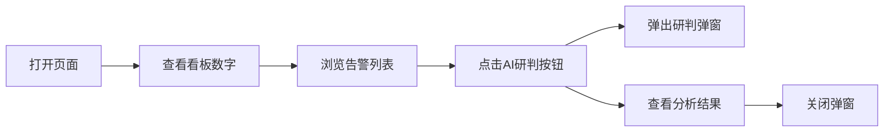

## 1. 产品概述

一个纯前端展示页面，无需后端服务，用于实时展示系统告警信息和关键指标看板。
- 主要用途：运维监控大屏，直观展示系统健康状态和告警信息
- 目标用户：运维人员、系统管理员

## 2. 核心功能

### 2.1 功能模块

1. **看板概览区**：顶部展示4个关键指标数字（如告警总数、高危告警、中危告警、已处理）
2. **告警列表**：以列表形式展示所有告警信息，每条告警右侧有"AI研判"按钮
3. **AI研判弹窗**：点击"AI研判"按钮后弹出模态窗口，展示AI分析内容

### 2.2 页面详情

| 页面名称 | 模块名称 | 功能描述 |
|---------|---------|---------|
| 监控大屏 | 看板概览区 | 展示4个关键指标数字卡片，含图标和数值变化趋势 |
| 监控大屏 | 告警列表 | 展示告警信息列表，包含告警名称、级别、时间、状态等 |
| 监控大屏 | AI研判弹窗 | 点击按钮弹出模态窗口，展示AI分析研判内容 |

## 3. 核心流程

用户打开页面 → 查看顶部4个看板数字 → 浏览下方告警列表 → 点击某条告警的"AI研判"按钮 → 弹出AI研判弹窗 → 查看AI分析结果 → 关闭弹窗

## 4. 用户界面设计

### 4.1 设计风格
- **整体风格**：深色主题（Dark Mode），科技感监控大屏风格
- **主色调**：深蓝/黑色背景 (#0a0e1a)，蓝色 (#00b4d8) 和高亮红 (#ff4d6d) 作为强调色
- **辅助色**：绿色 (#52b788) 表示安全/已处理，橙色 (#f9a826) 表示警告
- **字体**：使用科技感字体，数字使用等宽字体增强可读性
- **布局**：顶部4卡片横向排列，下方为全宽告警列表
- **动效**：数字滚动动画、卡片悬停效果、弹窗渐变出现

### 4.2 页面设计概览

| 页面名称 | 模块名称 | UI元素 |
|---------|---------|--------|
| 监控大屏 | 看板概览区 | 4个卡片，每个包含图标、数字标签、小标题，背景带微光效 |
| 监控大屏 | 告警列表 | 表格形式，列包含：告警名称、级别(带色标)、时间、状态、AI研判按钮 |
| 监控大屏 | AI研判弹窗 | 模态弹窗，半透明背景，内容区域展示AI分析详细文本 |

### 4.3 响应式
- 桌面优先设计，适配 1920x1080 分辨率
- 看板卡片在窄屏下自动换行排列