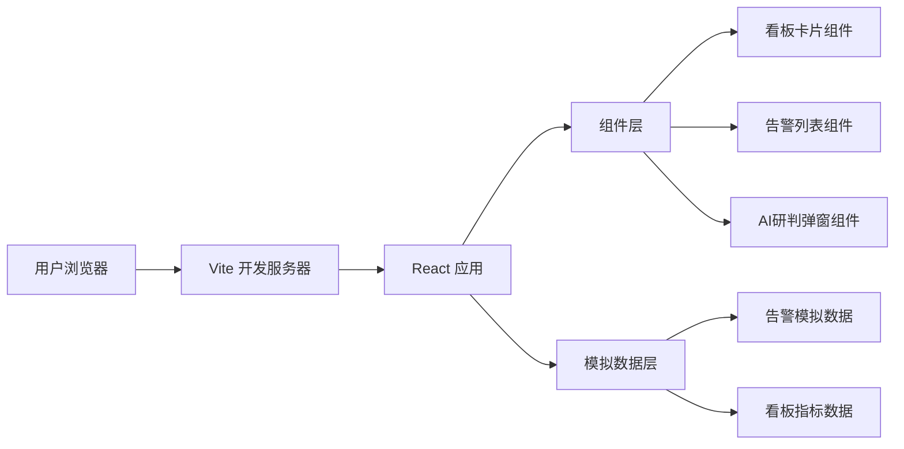

## 1. 架构设计



## 2. 技术选型

- **前端框架**：React@18 + TypeScript
- **构建工具**：Vite
- **样式方案**：Tailwind CSS
- **UI库**：无额外UI库依赖，纯自定义组件
- **数据**：前端硬编码模拟数据
- **后端**：无（纯前端项目）

## 3. 组件结构

```
src/
├── App.tsx                    # 主应用组件
├── main.tsx                   # 入口文件
├── index.css                  # 全局样式
├── components/
│   ├── DashboardCard.tsx      # 看板数字卡片组件
│   ├── AlertTable.tsx         # 告警列表组件
│   └── AiAnalysisModal.tsx    # AI研判弹窗组件
├── data/
│   └── mockData.ts            # 模拟数据
└── types/
    └── index.ts               # 类型定义
```

## 4. 路由定义

| 路由 | 用途 |
|------|------|
| / | 监控大屏主页（单页应用，仅一个页面） |

## 5. 数据模型

### 5.1 看板指标数据模型

```typescript
interface DashboardMetric {
  id: string;
  label: string;
  value: number;
  icon: string;
  color: string;
  trend: 'up' | 'down' | 'stable';
  trendValue: string;
}
```

### 5.2 告警数据模型

```typescript
interface AlertItem {
  id: string;
  name: string;
  level: 'critical' | 'warning' | 'info';
  time: string;
  status: 'pending' | 'processing' | 'resolved';
  detail: string;
}
```